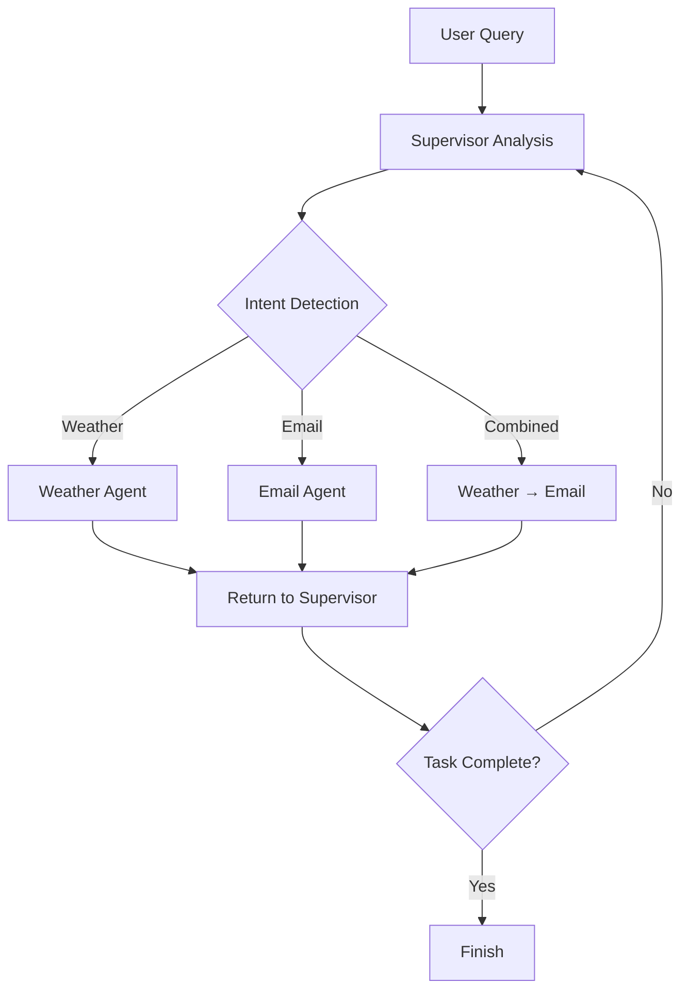

# Multi-Agent Supervisor System

A production-ready, modularized multi-agent system built with LangGraph that coordinates weather and email specialists through an intelligent supervisor.

## 🏗️ Architecture

```
project_root/
├── agents/                 # Agent definitions and creation
│   ├── weather_agent.py   # Weather specialist agent
│   ├── email_agent.py     # Email specialist agent
│   └── supervisor_agent.py # Supervisor coordination agent
│
├── tools/                  # Tool implementations
│   ├── timing_tracker.py  # Performance monitoring
│   ├── weather_tool.py     # Weather API integration
│   ├── email_tool.py       # Email sending functionality
│   └── handoff_tools.py    # Agent coordination tools
│
├── graph/                  # LangGraph workflow logic
│   ├── nodes.py           # Individual node functions
│   ├── routing.py         # Decision and routing logic
│   └── workflow.py        # Graph compilation and execution
│
├── config/                # Configuration management
│   └── constants.py       # Environment variables and settings
│
├── utils/                 # Utility functions
│   ├── messaging.py       # Pretty printing and message handling
│   └── intent_analysis.py # Intent recognition and completion tracking
│
├── run.py                 # Main entry point
├── .env-template          # Environment variable template
└── requirements.txt       # Python dependencies
```

## 🚀 Quick Start

1. **Clone and Setup**
   ```bash
   git clone <repository>
   cd test_multiagent
   pip install -r requirements.txt
   ```

2. **Configure Environment**
   ```bash
   cp .env-template .env
   # Edit .env with your API keys and credentials
   ```

3. **Validate Setup**
   ```bash
   python run.py validate
   ```

4. **Run Examples**
   ```bash
   python run.py examples
   ```

## 🔧 Configuration

### Required Environment Variables

| Variable | Description | Example |
|----------|-------------|---------|
| `SENDER_EMAIL` | Gmail address for sending emails | `your-email@gmail.com` |
| `SENDER_PASSWORD` | Gmail app password | `your-app-password` |
| `RECEIVER_EMAIL` | Recipient email address | `recipient@gmail.com` |
| `OPENWEATHER_API_KEY` | OpenWeather API key | Get from [OpenWeatherMap](https://openweathermap.org/api) |

### Optional Environment Variables

| Variable | Default | Description |
|----------|---------|-------------|
| `OLLAMA_MODEL` | `llama3.1:latest` | LLM model name |
| `OLLAMA_BASE_URL` | Custom URL | LLM API base URL |
| `LLM_TEMPERATURE` | `0.4` | LLM temperature setting |
| `RECURSION_LIMIT` | `10` | Max workflow recursion |
| `TIMEOUT_SECONDS` | `30` | API request timeout |

## 🎯 Usage

### Command Line Interface

```bash
# Run validation
python run.py validate

# Run example queries (default)
python run.py examples

# Interactive mode
python run.py interactive

# Single query
python run.py query "What's the weather in Paris?"
```

### Example Queries

**Weather Queries:**
- "What's the weather like in Paris?"
- "Check the weather in London"
- "Get weather for Tokyo"

**Email Queries:**
- "Send me an email with subject 'Test' and body 'Hello world'"
- "Email me with subject 'Update' and body 'Project status'"

**Combined Queries:**
- "Get weather for NYC and email it to me"
- "Check weather in Berlin and send it via email with subject 'Weather Report'"

## 🧠 How It Works

### Agent Coordination

1. **Supervisor Agent**: Analyzes requests and routes to appropriate specialists
2. **Weather Agent**: Fetches weather data using OpenWeather API
3. **Email Agent**: Sends emails via SMTP with weather data integration

### Workflow Process



### Intent Analysis

The system automatically detects:
- **Weather requests**: Keywords like "weather", "temperature", "forecast"
- **Email requests**: Keywords like "email", "send", "mail", "notify"
- **Combined requests**: Both weather and email keywords present

## 📊 Performance Monitoring

Built-in timing tracker monitors:
- Total execution time
- Individual component performance
- Agent processing times
- API call durations

## 🔒 Security Features

- Environment variable isolation
- Configuration validation
- Error handling and logging
- Secure SMTP authentication

## 🛠️ Development

### Adding New Agents

1. Create agent file in `agents/`
2. Add tools in `tools/`
3. Update routing logic in `graph/routing.py`
4. Add node function in `graph/nodes.py`

### Testing

```bash
# Validate system
python run.py validate

# Test specific functionality
python run.py query "test query"

# Interactive testing
python run.py interactive
```

## 📦 Dependencies

- **langchain-core**: Core LangChain functionality
- **langchain-openai**: OpenAI/Ollama integration
- **langgraph**: Multi-agent workflow graphs
- **python-dotenv**: Environment variable management
- **requests**: HTTP client for API calls
- **typing-extensions**: Enhanced type hints

## 🎉 Benefits of This Architecture

✅ **Separation of Concerns**: Each module has a single responsibility  
✅ **Reusability**: Components can be imported and tested independently  
✅ **Scalability**: Easy to add new agents and capabilities  
✅ **Maintainability**: Clear structure prevents "spaghetti code"  
✅ **Type Safety**: Comprehensive type hints throughout  
✅ **Production Ready**: Proper error handling, logging, and configuration  

## 🤝 Contributing

1. Follow the modular structure
2. Add type hints to all functions
3. Include docstrings for public methods
4. Test changes with `python run.py validate`
5. Update documentation as needed

## 📄 License

This project is open source. See LICENSE file for details. 